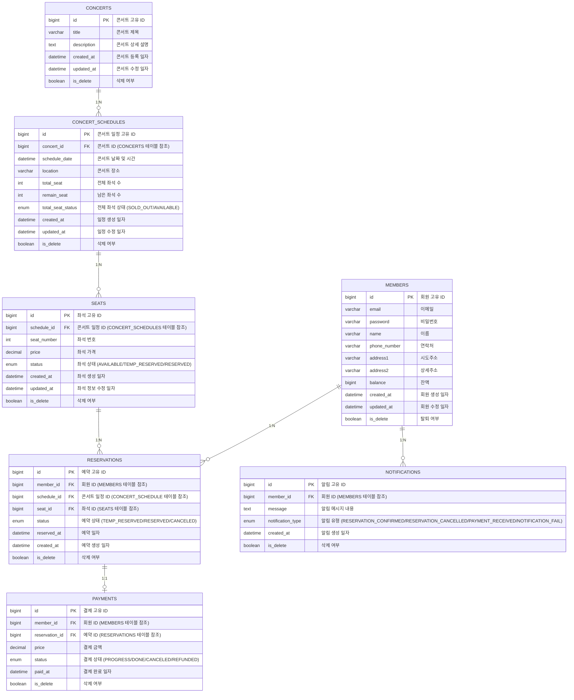

**[ ERD ]**

```mermaid
erDiagram
    MEMBERS {
        bigint id PK "회원 고유 ID"
        varchar email "이메일"
        varchar password "비밀번호"
        varchar name "이름"
        varchar phone_number "연락처"
        varchar address1 "시도주소"
        varchar address2 "상세주소"
        bigint balance "잔액"
        datetime created_at "회원 생성 일자"
        datetime updated_at "회원 수정 일자"
        boolean is_delete "탈퇴 여부"
    }

    CONCERTS {
        bigint id PK "콘서트 고유 ID"
        varchar title "콘서트 제목"
        text description "콘서트 상세 설명"
        datetime created_at "콘서트 등록 일자"
        datetime updated_at "콘서트 수정 일자"
        boolean is_delete "삭제 여부"
    }

    CONCERT_SCHEDULES {
        bigint id PK "콘서트 일정 고유 ID"
        bigint concert_id FK "콘서트 ID (CONCERTS 테이블 참조)"
        datetime schedule_date "콘서트 날짜 및 시간"
        varchar location "콘서트 장소"
        int total_seat "전체 좌석 수"
        int remain_seat "남은 좌석 수"
        enum total_seat_status "전체 좌석 상태 (SOLD_OUT/AVAILABLE)"
        datetime created_at "일정 생성 일자"
        datetime updated_at "일정 수정 일자"
        boolean is_delete "삭제 여부"
    }

    SEATS {
        bigint id PK "좌석 고유 ID"
        bigint schedule_id FK "콘서트 일정 ID (CONCERT_SCHEDULES 테이블 참조)"
        int seat_number "좌석 번호"
        decimal price "좌석 가격"
        enum status "좌석 상태 (AVAILABLE/TEMP_RESERVED/RESERVED)"
        datetime created_at "좌석 생성 일자"
        datetime updated_at "좌석 정보 수정 일자"
        boolean is_delete "삭제 여부"
    }

    RESERVATIONS {
        bigint id PK "예약 고유 ID"
        bigint member_id FK "회원 ID (MEMBERS 테이블 참조)"
        bigint schedule_id FK "콘서트 일정 ID (CONCERT_SCHEDULE 테이블 참조)"
        bigint seat_id FK "좌석 ID (SEATS 테이블 참조)"
        enum status "예약 상태 (TEMP_RESERVED/RESERVED/CANCELED)"
        datetime reserved_at "예약 일자"
        datetime created_at "예약 생성 일자"
        boolean is_delete "삭제 여부"
    }

    PAYMENTS {
        bigint id PK "결제 고유 ID"
        bigint member_id FK "회원 ID (MEMBERS 테이블 참조)"
        bigint reservation_id FK "예약 ID (RESERVATIONS 테이블 참조)"
        decimal price "결제 금액"
        enum status "결제 상태 (PROGRESS/DONE/CANCELED/REFUNDED)"
        datetime paid_at "결제 완료 일자"
        boolean is_delete "삭제 여부"
    }

    NOTIFICATIONS {
        bigint id PK "알림 고유 ID"
        bigint member_id FK "회원 ID (MEMBERS 테이블 참조)"
        text message "알림 메시지 내용"
        enum notification_type "알림 유형 (RESERVATION_CONFIRMED/RESERVATION_CANCELLED/PAYMENT_RECEIVED/NOTIFICATION_FAIL)"
        datetime created_at "알림 생성 일자"
        boolean is_delete "삭제 여부"
    }

    CONCERTS ||--o{ CONCERT_SCHEDULES : "1:N"
    CONCERT_SCHEDULES ||--o{ SEATS : "1:N"
    SEATS ||--o{ RESERVATIONS : "1:N"
    MEMBERS ||--o{ RESERVATIONS : "1:N"
    RESERVATIONS ||--o| PAYMENTS : "1:1"
    MEMBERS ||--o{ NOTIFICATIONS : "1:N"
```